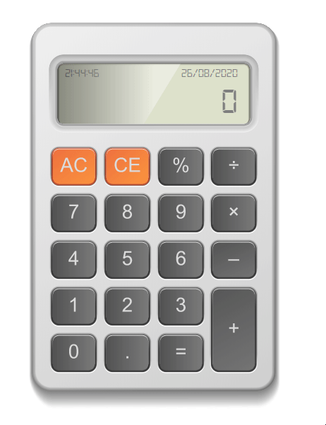

# Calculadora em JavaScript

Calculadora desenvolvida em JavaScript.
O código HTML pode parecer confuso para quem não o conhece, pois foi criado em Illustrator (.SVG), a partir dele foi possível desenvolver
todas as funcionalidades em Javascript.

O código JS com certeza te ajudará bastante, pois está todo por funções,
criei utilizando o conceito de orientação a objeto, então está fácil de reaproveitar o código no seu projeto.

### Funcionalidades:

1 - Ao clicar duas vezes no botão "AC" é possível habilitar e desabilitar o áudio

2 - Inteligência no botão igual e nos botões de operações

3 - Função de estouro demonstrando "ERROR"

Obs: Comentei o código em português, porém o código está em inglês, pois estou aprendendo a programar em inglês como ensina no curso.

### Projeto

